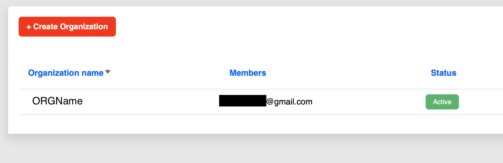

# DigikeyAPI
Used to get Product Information and HTSUS

## Get Started with DigiKey API: A Developer Registration Guide

This guide outlines the steps to register as a developer and begin using the DigiKey API.

See Getting Start at [here](https://developer.digikey.com) (see bottom of the webpage)

### Step 1: Register or Login to My DigiKey
*   Log in with your existing "My DigiKey" account credentials to create a Appliation for API.
*   If you don't have a "My DigiKey" account, register for one.
    *   [Register / Login](https://developer.digikey.com)

### Step 2: Create an Orgnization and Application
*   Create an Organization and Application to start your development immediately. And find the 

 
### Step 3: Look for the ClientID and ClientSecret to connect to API via OAuth2.0

  

### You can further improve the class for other function by Exploring the Available APIs

*   Visit the DigiKey API page to explore the available API options. Determine which API best suits your application needs.
    *   [Explore DigiKey APIs](https://developer.digikey.com/products)
